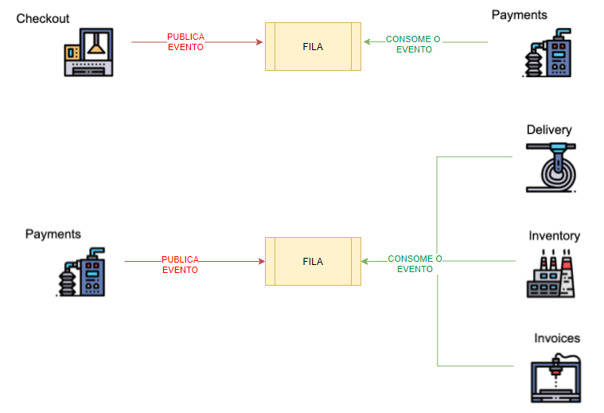
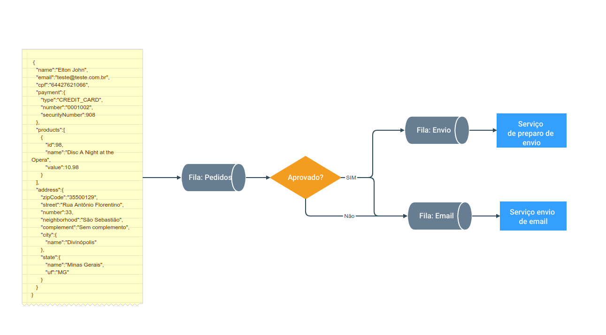
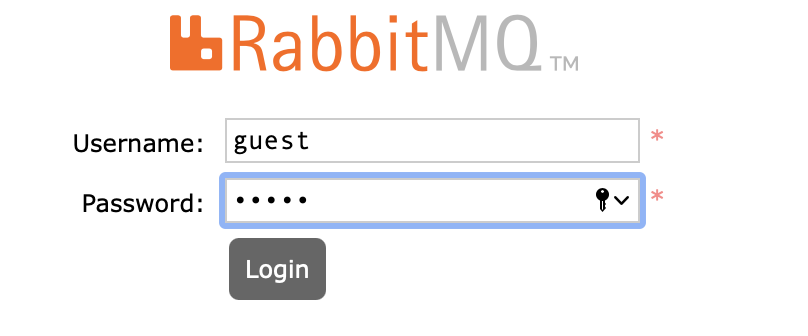
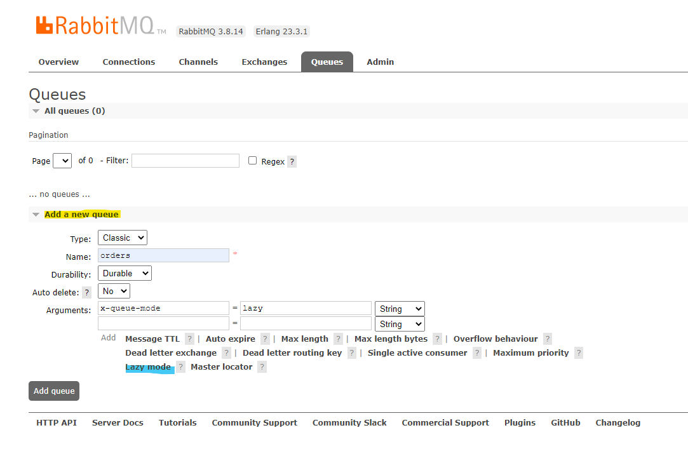
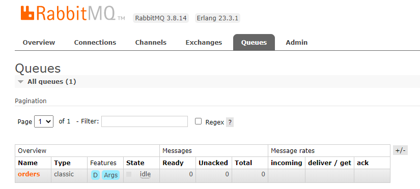
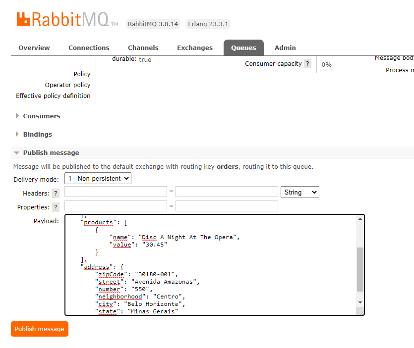
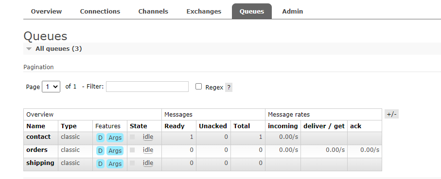
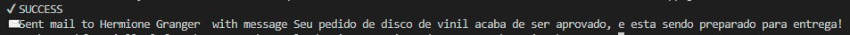
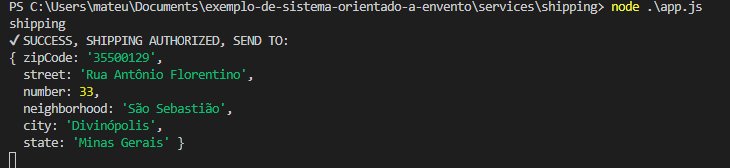

# Pub-Sub-Store: Exemplo Prático de Arquitetura Publish/Subscribe

Este repositório contem um exemplo simples de uma loja virtual construída usando uma **arquitetura publish/subscribe**.

O exemplo foi projetado para ser usado em uma aula prática sobre esse tipo de arquitetura, que pode, por exemplo, ser realizada após o estudo do [Capítulo 7](https://engsoftmoderna.info/cap7.html) do livro [Engenharia de Software Moderna](https://engsoftmoderna.info).

O objetivo é permitir que o aluno tenha um primeiro contato prático com arquiteturas Publish/Subscribe e com tecnologias usadas na implementação das mesmas. Especificamente, usaremos o sistema  [RabbitMQ](https://www.rabbitmq.com) como *broker* (ou seja um canal/meio de comunicação) para assinatura, publicação e armazenamento de eventos.


## Arquiteturas Publish/Subscribe

Em arquiteturas tradicionais, um cliente faz uma requisição para um serviço que processa e retorna uma mensagem sincronamente. 

Por outro lado, em arquiteturas Publish/Subscribe, temos um **modelo de comunicação assíncrono e fracamente acoplado**, no qual uma aplicação gera eventos que serão processados por outras aplicações que tiverem interesse nele.

Suponha uma loja virtual construída usando uma arquitetura Pub/Sub, conforme ilustrado a seguir. 



Nessa loja, existe um processo que recebe as compras (*Checkout*) e que publica um evento solicitando o pagamento. Esse evento é consumido assincronamente pelo serviço de pagamento (*Payments*), conforme ilustrado na parte superior da figura.

Em seguida, e supondo que o pagamento foi realizado, esse último serviço publica um novo evento, sinalizando o sucesso da operação (parte inferior da figura). Esse segundo evento é consumido, sempre assincronamente, pelos seguintes serviços:

* *Delivery*, que é responsável por fazer a entrega das mercadorias compradas.

* *Inventory*, que vai atualizar o estoque da loja.

* *Invoices*, que vai gerar a nota fiscal relativa à compra.

Portanto, em uma arquitetura Pub/Sub temos dois tipos de sistemas (ou processos):

 * **Produtores**, que são responsáveis por publicar eventos.
 
 * **Consumidores**, que são assinantes de eventos, ou seja, eles maninfestam antecipadamente que querem ser notificados sempre que um determinado evento ocorrer. 

No nosso exemplo, o serviço de pagamento é tanto consumidor do evento de solicitação de pagamento como produtor de eventos para os demais processos do sistema. 

Para desenvolver aplicações com arquiteturas Pub/Sub são utilizadas ferramentas -- também chamadas de **brokers** -- que disponibilizam funções para publicar, assinar e receber eventos. Além disso, esses brokers implementam internamente as filas que vão armazenar os eventos produzidos e consumidos na aplicação. 

No nosso roteiro, conforme afirmamos, vamos usar um broker chamado [RabbitMQ](https://www.rabbitmq.com). Ele foi escolhido por ser mais simples e fácil de usar.

 ## Sistema de Exemplo

Vamos agora implementar uma loja virtual com uma arquitetura Pub/Sub, de forma semelhante ao exemplo mostrado na seção anterior. 

Imagine que essa loja vende discos de vinil e que temos que implementar o seu sistema de pós-venda. Por isso, a compra de um disco será o evento principal do sistema. Quando ele ocorrer, temos que verificar se o pedido é válido ou não, ou sejá se tem os dados necessários para a compra ser efetuada com sucesso ou se faltou alguma informação para que possamos prosseguir com a compra. Se ele for válido, temos que:

 * Notificar o cliente de que o seu pedido foi aprovado.
 * Notificar a equipe de transporte de que temos uma nova entrega para fazer. 

 Por outro lado, caso o pedido seja inválido teremos que:
 
* Notificar o cliente de que faltou uma determinada informação no seu pedido.

Essas ações são independentes, ou seja, o cliente não vai ficar esperando o término de todo o processamento de seu pedido. Em vez disso, podemos informá-lo de que o seu pedido está sendo processado e, quando finalizarmos tudo, ele será avisado. 

Temos portanto a seguinte arquitetura mais detalhada:



Borá colocá-la em prática?  Primeiro, faça um fork deste repositório (veja botão no canto superior direito do site) e siga os três passos a seguir.

## Passo 1: Instalando, Executando e Inicializando o RabbitMQ

Como afirmamos antes, a lógica de Pub/Sub do nosso sistema será gerenciada pelo RabbitMQ. Ou seja, o armazenamento, publicação, assinatura e notificação de eventos será de responsabilidade desse broker. 

Para facilitar o seu uso e execução, neste repositório já temos um container Docker com uma imagem do RabbitMQ. Se você não possui o Docker instalado na sua máquina, veja como fazer isso no seguinte [link](https://www.docker.com/products/docker-desktop).

Após o download, basta executar o Docker e, em seguida, executar o comando abaixo, na pasta raiz do projeto:

```
docker-compose up -d q-rabbitmq
````

Após rodar esse comando, uma imagem do RabbitMQ estará executando localmente e podemos acessar sua interface gráfica, digitando no navegador: http://localhost:15672 

Por padrão, o acesso a interface terá como usuario e senha a palvra: guest (conforme imagem a baixo). Este usuario pode ser modificados, editando este [arquivo](https://github.com/aserg-ufmg/pub-sub-store/blob/263c006556f2989324459ca9bd43544905e4335d/rabbitmq/q-rabbitmq-auth.env)




Por meio dessa interface, é possível monitorar as filas que são gerenciadas pelo RabbitMQ. Por exemplo, pode-se ver o número de mensagens em cada fila e as aplicações que estão conectadas nelas.

No entanto, ainda não temos nenhuma fila. Vamos, portanto, criar uma, mesmo sem nenhum outro processo ainda estar rodando. 

Como ilustrado na próxima figura, vá até a guia `Queues`, na sessão `add a new queue`. Preencha os campos `name` como `orders` e clique na opção `lazy mode`. Essa opção fará com que a fila utilize mais o disco rígido do que a memória RAM, não prejudicando o desempenho dos processos que vamos criar nos próximos passos.



Com a fila criada, podemos agora criar um evento representando um pedido, de acordo com o formato abaixo (substitua os campos com dados fictícios à sua escolha):

````json
{
    "name": "NOME_DO_CLIENTE",
    "email": "EMAIL_DO_CLIENTE",
    "cpf": "CPF_DO_CLIENTE",
    "creditCard": {
        "number": "NUMERO_DO_CARTAO_DE_CREDITO",
        "securityNumber": "CODIGO_DE_SEGURANCA"
    },
    "products": [
        {
            "name": "NOME_DO_PRODUTO",
            "value": "VALOR_DO_PRODUTO"
        }
    ],
    "address": {
        "zipCode": "CEP",
        "street": "NOME_DA_RUA",
        "number": "NUMERO_DA_RESIDENCIA",
        "neighborhood": "NOME_DO_BAIRO",
        "city": "NOME_DA CIDADE",
        "state": "NOME_DO_ESTADO"
    }
}
````

Com o JSON preenchido, clique na fila na qual deseja inserir a mensagem, que neste caso é `orders`



Na sessão `Publish message`, copie o JSON no campo `Payload`. Em seguida, clique em `publish message`



## Passo 2: Subindo os Serviços

### 1º Serviço: Processamento dos Pedidos

Até este momento, temos uma fila `orders`, com um evento em espera para ser processado. Ou seja, está na hora de subir uma aplicação para consumi-lo.

Na pasta `service` deste repositório, já implementamos o serviço [orders](/services/order), cuja função é ler pedidos da fila de mesmo nome e verificar se eles são válidos ou não. Se o pedido for válido, ele será encaminhado para duas filas: contactar cliente (*contact*) e preparo de envio (*shipping*), como é possivel ver no seguinte código:

``` JavaScript
async function processMessage(msg) {
    const orderData = JSON.parse(msg.content)
    try {
        if(isValidOrder(orderData)) {
            await (await RabbitMQService.getInstance()).send('contact', { 
                "clientFullName": orderData.name,
                "to": orderData.email,
                "subject": "Pedido Aprovado",
                "text": `${orderData.name}, seu pedido de disco de vinil acaba de ser aprovado, e esta sendo preparado para entrega!`,
            })
            await (await RabbitMQService.getInstance()).send('shipping', orderData)
            console.log(`✔ PEDIDO APROVADO`)
        } else {
            await (await RabbitMQService.getInstance()).send('contact', { 
                "clientFullName": orderData.name,
                "to": orderData.email,
                "subject": "Pedido Reprovado",
                "text": `${orderData.name}, seus dados não foram suficientes para realizar a compra :( por favor tente novamente!`,
            })
            console.log(`X PEDIDO REPROVADO`)
        }
    } catch (error) {
        console.log(`X ERROR TO PROCESS: ${error.response}`)
    }
}

```
Para inicializar o serviço, basta executar o seguinte comando na raiz do projeto:

```
docker-compose up -d --build order-service
````
Após executá-lo, você pode acessar o log da aplicação por meio do seguinte comando:

````
 docker logs order-service
````

Ao analisar esse log, pode-se ver que a mensagem que inserimos na fila do RabittMQ no passo anterior foi processada com sucesso. 

O que acabamos de fazer ilustra uma característica importante de aplicações construídas com uma arquitetura Pub/Sub: elas são tolerantes a falhas. Por exemplo, se um  consumidor estiver fora do ar, o evento não se perde e será processado assim que o consumidor ficar disponível novamente.

Outra coisa que vale a pena mencionar: ao acessar a aba `Queues` no RabbitMQ, vamos ver que existem duas novas filas:



Essas novas filas, `shipping` e `contact`, serão usadas, respectivamente, para comunicação com dois novos serviços:

* Um serviço que solicita o envio da mercadoria
* Um serviço que contacta o cliente por email, informando se seu pedido foi aprovado ou não.

Ambos já estão implementados em nosso reposistório, conforme explicaremos a seguir.

### 2º Serviço: Envio de E-mail para Cliente 

O serviço [contact](/services/contact) implementa uma lógica que contacta o cliente por e-mail, informando o status da sua compra.  Ele assina os eventos da fila `contact` e, para cada novo evento, envia um email para o cliente responsável pela compra. A seguinte função `processMessage(msg)` é responsável por isso:

```JavaScript
async function processMessage(msg) {
    const mailData = JSON.parse(msg.content)
    try {
        const mailOptions = {
            'from': process.env.MAIL_USER,
            'to': `${mailData.clientFullName} <${mailData.to}>`,
            'cc': mailData.cc || null,
            'bcc': mailData.cco || null,
            'subject': mailData.subject,
            'text': mailData.text,
            'attachments': null
        }

        fs.writeFileSync(`${new Date()} - ${mailOptions.subject}.txt`, mailOptions);
 
        console.log(`✔ SUCCESS`)
    } catch (error) {
        console.log(`X ERROR TO PROCESS: ${error.response}`)
    }
}
```

Para manter o tutorial auto contido, no exemplo não iremos de fato enviar um email, iremos criar arquivos txt com o conteúdo que teria o email, para poder observar como seria os emaisl caso estivessemos de fato enviado. 

Para enviar emails de verdade bastaria substituir a escrita do arquivo para um provedor de envio. A provedores de testes também no mercado, caso queira testar, um serviço possivel de se usar é o [mailtrap](https://mailtrap.io/).

 Continuando o fluxo, chegou a hora de executar a aplicação, que assim como o serviço `orders`, pode ser inicializada via Docker, por meio do seguinte comando (sempre chamado na raiz do projeto):

```
docker-compose up -d --build contact-service
````
 
Assim que o build finalizar, o serviço `contact-service` irá se conectar com RabbitMQ, consumirá a mensagem e notificará o cliente por email de que sua compra foi processada, conforme mostrado na seguinte mensagem de log:



Para visualizar esse log, basta executar:

````
 docker logs contact-service
````

Outra forma de verificar que a mensagem foi enviada, é certificando-se que foi criado o arquivo .json com o email dentro do projeto contact.

### 3º Serviço: Responsável por solicitar o envio de mercadoria

E agora temos que colocar o terceiro serviço no ar. Esse serviço encaminha o pedido para o departamento de despacho, que será responsável por enviar a encomenda para a casa do cliente. Essa tarefa é de responsabilidade do serviço [shipping](/services/shipping), que conecta-se à fila `shipping` do RabbitMQ  e exibe o endereço da entrega.


```JavaScript
async function processMessage(msg) {
    const deliveryData = JSON.parse(msg.content)
    try {
        if(deliveryData.address && deliveryData.address.zipCode) {
            console.log(`✔ SUCCESS, SHIPPING AUTHORIZED, SEND TO:`)
            console.log(deliveryData.address)
        } else {
            console.log(`X ERROR, WE CAN'T SEND WITHOUT ZIPCODE :'(`)
        }

    } catch (error) {
        console.log(`X ERROR TO PROCESS: ${error.response}`)
    }
}
```

Para executar esse terceiro serviço, basta usar:

```
docker-compose up -d --build shipping-service
````

E, como fizemos antes, para visualizar as informações exibidas pela aplicação, basta acessar o seu log:

````
 docker logs shipping-service
````



**Comentário Final:** Com isso, executamos todos os serviços da nossa loja virtual.

Mas sugerimos que você faça novos testes, para entender melhor os benefícios desse tipo de arquitetura. Por exemplo, você pode:

* Subir e derrubar os serviços, em qualquer ordem, e testar se não há perda de mensagens.
* Publicar uma nova mensagem na fila e testar se ela vai ser mesmo consumida por todos os serviços.

Para encerrar o container e finalizar as aplicações, basta executar: 

````
docker-compose down
````

## Passo 3:  Colocando a Mão na Massa

Ao terminar o projeto, sentimos falta de uma aplicação para gerar relatórios com os pedidos que foram feitos. Mas felizmente estamos usando uma arquitetura Pub/Sub e apenas precisamos "plugar" esse novo serviço no sistema.

Após uma venda ser entregue com sucesso, publicamos o resultado numa fila chamada report, portanto para realizar a análise basta consumir os eventos publicados na fila `reports`. 

Seria possível nos ajudar e colocar em prática o que viu neste tutorial e construir uma aplicação que gere este relatório? 

Nós começamos a construí-la e vocês podem usar o nosso código como [exemplo](https://github.com/franneves/exemplo-de-uma-arquitetura-orientada-a-eventos/tree/master/services/report). Mas não precisa ficar limitado a ele, você pode consumir mensagens de diferentes formas e com outras linguagens de programação. Por exemplo, existem tutoriais que explicam como consumir mensagens em Python, C# , Ruby e JavaScript neste [guia](https://www.rabbitmq.com/getstarted.html).

Qualquer dúvida, sintam-se à vontade para nos procurar: francielly.neves2@gmail.com

## Outros Brokers de Eventos

No roteiro, devido à sua interface de mais fácil uso, optamos por usar o RabbitMQ, mas há outros sistemas que poderíamos ter utilizado e que são também bastante famosos, tais como [Apache Kafka](https://kafka.apache.org/intro) e [Redis](https://redis.io/topics/pubsub).

## Créditos

Este exercício prático, incluindo o seu código, foi elaborado por **Francielly Neves**, aluna de Sistemas de Informação da UFMG, como parte das suas atividades na disciplina Monografia II, cursada em 2021/1, sob orientação do **Prof. Marco Tulio Valente**.

O código deste repositório possui uma licença MIT. O roteiro descrito acima possui uma licença CC-BY.
