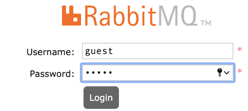

# Pub-Sub-Store: Exemplo Prático de Arquitetura Publish/Subscribe
 
Este repositório contém um exemplo simples de uma loja virtual construída usando uma **arquitetura publish/subscribe**.
 
O exemplo foi projetado para ser usado em uma aula prática sobre esse tipo de arquitetura, que pode, por exemplo, ser realizada após o estudo do [Capítulo 7](https://engsoftmoderna.info/cap7.html) do livro [Engenharia de Software Moderna](https://engsoftmoderna.info).
 
O objetivo é permitir que o aluno tenha um primeiro contato prático com arquiteturas Publish/Subscribe e com tecnologias usadas na implementação das mesmas. Especificamente, usaremos o sistema  [RabbitMQ](https://www.rabbitmq.com) como *broker* (ou seja um canal/meio de comunicação) para assinatura, publicação e armazenamento de eventos.
 
 
## Arquiteturas Publish/Subscribe
 
Em arquiteturas tradicionais, um cliente faz uma requisição para um serviço que processa e retorna uma mensagem sincronamente. 
 
Por outro lado, em arquiteturas Publish/Subscribe, temos um **modelo de comunicação assíncrono e fracamente acoplado**, no qual uma aplicação gera eventos que serão processados por outras aplicações que tiverem interesse nele.
 
Suponha uma loja virtual construída usando uma arquitetura Pub/Sub, conforme ilustrado a seguir. 
 

 
Nessa loja, existe um processo que recebe as compras (*Checkout*) e que publica um evento solicitando o pagamento. Esse evento é consumido assincronamente pelo serviço de pagamento (*Payments*), conforme ilustrado na parte superior da figura.
 
Em seguida, e supondo que o pagamento foi realizado, esse último serviço publica um novo evento, sinalizando o sucesso da operação (parte inferior da figura). Esse segundo evento é consumido, sempre assincronamente, pelos seguintes serviços:
 
* *Delivery*, que é responsável por fazer a entrega das mercadorias compradas.
 
* *Inventory*, que vai atualizar o estoque da loja.
 
* *Invoices*, que vai gerar a nota fiscal relativa à compra.
 
Portanto, em uma arquitetura Pub/Sub temos dois tipos de sistemas (ou processos):
 
 * **Produtores**, que são responsáveis por publicar eventos.
 
 * **Consumidores**, que são assinantes de eventos, ou seja, eles manifestam antecipadamente que querem ser notificados sempre que um determinado evento ocorrer. 
 
No nosso exemplo, o serviço de pagamento é tanto consumidor do evento de solicitação de pagamento como produtor de eventos para os demais processos do sistema. 
 
Para desenvolver aplicações com arquiteturas Pub/Sub são utilizadas ferramentas -- também chamadas de **brokers** -- que disponibilizam funções para publicar, assinar e receber eventos. Além disso, esses brokers implementam internamente as filas que vão armazenar os eventos produzidos e consumidos na aplicação. 
 
No nosso roteiro, conforme afirmamos, vamos usar um broker chamado [RabbitMQ](https://www.rabbitmq.com). Ele foi escolhido por ser mais simples e fácil de usar.
 
 ## Sistema de Exemplo
 
Vamos agora implementar uma loja virtual com uma arquitetura Pub/Sub, de forma semelhante ao exemplo mostrado na seção anterior. 
 
Imagine que essa loja vende discos de vinil e que temos que implementar o seu sistema de pós-venda. Por isso, a compra de um disco será o evento principal do sistema. Quando ele ocorrer, temos que verificar se o pedido é válido ou não, ou seja se tem os dados necessários para a compra ser efetuada com sucesso ou se faltou alguma informação para que possamos prosseguir com a compra. Se ele for válido, temos que:
 
 * Notificar o cliente de que o seu pedido foi aprovado.
 * Notificar a equipe de transporte de que temos uma nova entrega para fazer. 
 
 Por outro lado, caso o pedido seja inválido teremos que:
 
* Notificar o cliente de que faltou uma determinada informação no seu pedido.
 
Essas ações são independentes, ou seja, o cliente não vai ficar esperando o término de todo o processamento de seu pedido. Em vez disso, podemos informá-lo de que o seu pedido está sendo processado e, quando finalizarmos tudo, ele será avisado. 
 
Temos portanto a seguinte arquitetura mais detalhada:
 

 
Borá colocá-la em prática?  Primeiro, faça um fork deste repositório (veja botão no canto superior direito do site) e siga os três passos a seguir.
 
## Passo 1: Instalando, Executando e Inicializando o RabbitMQ
 
Como afirmamos antes, a lógica de Pub/Sub do nosso sistema será gerenciada pelo RabbitMQ. Ou seja, o armazenamento, publicação, assinatura e notificação de eventos será de responsabilidade desse broker. 
 
Para facilitar o seu uso e execução, neste repositório já temos um container Docker com uma imagem do RabbitMQ. Se você não possui o Docker instalado na sua máquina, veja como fazer isso no seguinte [link](https://www.docker.com/products/docker-desktop).

**Importante**: Dependendo da configuração de grupos do seu computador, pode ser necessário rodar os comandos do Docker com `sudo`. Porém, caso queira contornar essa situação, você pode seguir alguns [tutoriais online](https://medium.com/devops-technical-notes-and-manuals/how-to-run-docker-commands-without-sudo-28019814198f) para acertar essa configuração.
 
Após o download, basta executar o Docker e, em seguida, executar o comando abaixo, na pasta raiz do projeto:
 
```
docker-compose up -d q-rabbitmq
````
 
Após rodar esse comando, uma imagem do RabbitMQ estará executando localmente e podemos acessar sua interface gráfica, digitando no navegador: http://localhost:15672 
 
Por padrão, o acesso a interface terá como usuário e senha a palavra: guest (conforme imagem abaixo). Este usuário pode ser modificados, editando este [arquivo](https://github.com/aserg-ufmg/pub-sub-store/blob/263c006556f2989324459ca9bd43544905e4335d/rabbitmq/q-rabbitmq-auth.env)
 

 
 
Por meio dessa interface, é possível monitorar as filas que são gerenciadas pelo RabbitMQ. Por exemplo, pode-se ver o número de mensagens em cada fila e as aplicações que estão conectadas nelas.
 
No entanto, ainda não temos nenhuma fila. Vamos, portanto, criar uma: 
 
Como ilustrado na próxima figura, vá até a guia `Queues and Streams`, na sessão `add a new queue`. Preencha o campo `name` como `orders` e adicione o argumento `x-queue-mode = lazy`. Essa opção fará com que a fila utilize mais o disco rígido do que a memória RAM, não prejudicando o desempenho dos processos que vamos criar nos próximos passos.

**Importante**: Tome cuidado para adicionar esses arguementos sem nenhum espaçamento a mais, pois isso pode gerar erros futuramente.
 

 
Com a fila criada, podemos agora criar um evento representando um pedido, de acordo com o formato abaixo (substitua os campos com dados fictícios à sua escolha):
 
````json
{
    "name": "NOME_DO_CLIENTE",
    "email": "EMAIL_DO_CLIENTE",
    "cpf": "CPF_DO_CLIENTE",
    "creditCard": {
        "number": "NUMERO_DO_CARTAO_DE_CREDITO",
        "securityNumber": "CODIGO_DE_SEGURANCA"
    },
    "products": [
        {
            "name": "NOME_DO_PRODUTO",
            "value": "VALOR_DO_PRODUTO"
        }
    ],
    "address": {
        "zipCode": "CEP",
        "street": "NOME_DA_RUA",
        "number": "NUMERO_DA_RESIDENCIA",
        "neighborhood": "NOME_DO_BAIRO",
        "city": "NOME_DA CIDADE",
        "state": "NOME_DO_ESTADO"
    }
}
````
 
Com o JSON preenchido, clique na fila na qual deseja inserir a mensagem, que neste caso é `orders`
 

 
Na sessão `Publish message`, copie o JSON no campo `Payload`. Em seguida, clique em `publish message`
 


Agora ao voltar ao menu `Queues and Streams`, você verá que a fila `orders` possui uma mensagem pendente, conforme a imagem abaixo:


 
## Passo 2: Subindo os Serviços
 
### 1º Serviço: Responsável por solicitar o envio de mercadoria
 
E agora vamos colocar o primeiro serviço no ar. Esse serviço encaminha o pedido para o departamento de despacho, que será responsável por enviar a encomenda para a casa do cliente. Essa tarefa é de responsabilidade do serviço [shipping](/services/shipping), que conecta-se à fila `shipping` do RabbitMQ  e exibe o endereço da entrega.
 
 
```JavaScript
async function processMessage(msg) {
    const deliveryData = JSON.parse(msg.content)
    try {
        if(deliveryData.address && deliveryData.address.zipCode) {
            console.log(`✔ SUCCESS, SHIPPING AUTHORIZED, SEND TO:`)
            console.log(deliveryData.address)
        } else {
            console.log(`X ERROR, WE CAN'T SEND WITHOUT ZIPCODE :'(`)
        }
 
    } catch (error) {
        console.log(`X ERROR TO PROCESS: ${error.response}`)
    }
}
```
 
Para executar esse serviço, basta usar:
 
```
docker-compose up -d --build shipping-service
````

E ele já estará em execução, com uma nova fila criada no RabbitMQ, chamada `shipping`. No entanto, o status das filas ainda não foi alterado, pois `shipping` ainda não consumiu a mensagem que está na fila `orders`. 


Isso será feito na próxima etapa com o serviço `orders` que vai ler a fila `orders` e processar a mensagem que acabamos de publicar. Assim, a nova mensagem processada vai chegar então no serviço de `shipping` para ser processada.

### 2º Serviço: Processamento dos Pedidos
 
Até este momento, temos uma fila `orders`, com um evento em espera para ser processado (`orders` atua como Produtor {Publisher}) e a fila `shipping` que está aguardando atualizações. Assim, está na hora de subir uma aplicação para consumir o pedido e dar continuidade ao processo (Subscriber).
 
Na pasta `service` deste repositório, já implementamos o serviço [orders](/services/order), cuja função é ler pedidos da fila de mesmo nome e verificar se eles são válidos ou não. Se o pedido for válido, ele será encaminhado para duas filas: contactar cliente (*contact*) e preparo de envio (*shipping*), como é possível ver no seguinte código:
 
``` JavaScript
async function processMessage(msg) {
    const orderData = JSON.parse(msg.content)
    try {
        if(isValidOrder(orderData)) {
            await (await RabbitMQService.getInstance()).send('contact', { 
                "clientFullName": orderData.name,
                "to": orderData.email,
                "subject": "Pedido Aprovado",
                "text": `${orderData.name}, seu pedido de disco de vinil acaba de ser aprovado, e esta sendo preparado para entrega!`,
            })
            await (await RabbitMQService.getInstance()).send('shipping', orderData)
            console.log(`✔ PEDIDO APROVADO`)
        } else {
            await (await RabbitMQService.getInstance()).send('contact', { 
                "clientFullName": orderData.name,
                "to": orderData.email,
                "subject": "Pedido Reprovado",
                "text": `${orderData.name}, seus dados não foram suficientes para realizar a compra :( por favor tente novamente!`,
            })
            console.log(`X PEDIDO REPROVADO`)
        }
    } catch (error) {
        console.log(`X ERROR TO PROCESS: ${error.response}`)
    }
}
 
```
Para inicializar o serviço, basta executar o seguinte comando na raiz do projeto:
 
```
docker-compose up -d --build order-service
````
Após executá-lo, você pode acessar o log da aplicação por meio do seguinte comando:
 
````
 docker logs order-service
````
 
Ao analisar este log, pode-se ver que a mensagem que inserimos na fila do RabbitMQ no passo anterior foi processada com sucesso, com o comando retornando `✔ PEDIDO APROVADO`.
 
O que acabamos de fazer ilustra uma característica importante de aplicações construídas com uma arquitetura Pub/Sub: elas são tolerantes a falhas. Por exemplo, se um  consumidor estiver fora do ar, o evento não se perde e será processado assim que o consumidor ficar disponível novamente.
 
Outra coisa que vale a pena mencionar: ao acessar a aba `Queues` no RabbitMQ, vamos ver que existem duas novas filas:
 

 
Essas novas filas, `report` e `contact`, serão usadas, respectivamente, para comunicação com dois novos serviços:
 
* Um serviço que prepara um relatório sobre os pedidos realizados.
* Um serviço que contacta o cliente por email, informando se o seu pedido foi aprovado ou não.

A fila `report` surgiu pois o serviço `shipping` já publica um evento nessa fila, informando que o pedido foi enviado. Ela não tinha sido criada anteriormente no passo 1 pois o serviço `shipping` ainda não estava em execução, somente a fila estava criada.
 
Ambos os serviços serão explicados posteriormente. Perceba como ao subir esse serviço consumidor, ele consumiu o pedido que estava em espera na fila `orders`, direcionou para `shipping` que também foi processado. Dessa forma, o status de ambas as filas acabou sendo alterado. Ao final, a fila `contact` e `report` ganharam novas mensagens, ainda não consumidas e que estão aguardando para serem processadas.

Somente relembrando (mas também é possível chegar a essa conclusão analisando o código dos serviços), a fila `contact` recebeu uma nova mensagem através do serviço de `order` e a fila `report` recebeu a nova mensagem através do serviço de `shipping`.

Agora que nosso serviço de `shipping` está em execução, conseguimos ver o status da sua operação. Para isso basta executar:
 
````
 docker logs shipping-service
````

Assim, será possível ver uma saída semelhante a essa dependendo de como você criou o pedido:


 
**Importante**: Caso o status do serviço `shipping` fosse checado logo na primeira etapa, nada seria retornado, visto que o serviço para consumir os pedidos ainda não tinha sido implementado. Portanto, o pedido ainda estaria na fila `orders`, aguardando para ser processado, como foi mostrado nas imagens acima.

### 3º Serviço: Envio de E-mail para Cliente 
 
O serviço [contact](/services/contact) implementa uma lógica que contacta o cliente por e-mail, informando o status da sua compra.  Ele assina os eventos da fila `contact` e, para cada novo evento, envia um email para o cliente responsável pela compra. A seguinte função `processMessage(msg)` é responsável por isso:
 
```JavaScript
async function processMessage(msg) {
    const mailData = JSON.parse(msg.content)
    try {
        const mailOptions = {
            'from': process.env.MAIL_USER,
            'to': `${mailData.clientFullName} <${mailData.to}>`,
            'cc': mailData.cc || null,
            'bcc': mailData.cco || null,
            'subject': mailData.subject,
            'text': mailData.text,
            'attachments': null
        }
 
        fs.writeFileSync(`${new Date()} - ${mailOptions.subject}.txt`, mailOptions);
 
        console.log(`✔ SUCCESS`)
    } catch (error) {
        console.log(`X ERROR TO PROCESS: ${error.response}`)
    }
}
```
 
Para manter o tutorial auto-contido, no exemplo não iremos de fato enviar um email. Em vez disso, iremos apenas criar arquivos .json com o conteúdo que teria o email, que serão salvos na raiz do projeto `contact`.
 
Para enviar emails de verdade bastaria usar um provedor de envio de e-mails. Existem também provedores de testes, como, por exemplo, o [mailtrap](https://mailtrap.io/).
 
 Continuando o fluxo, chegou a hora de executar a aplicação, que assim como o serviço `orders`, pode ser inicializada via Docker, por meio do seguinte comando (sempre chamado na raiz do projeto):
 
```
docker-compose up -d --build contact-service
````
 
Assim que o build finalizar, o serviço `contact-service` irá se conectar com RabbitMQ, consumirá a mensagem e gerará o arquivo .json com o conteúdo do email, na pasta do projeto `contact`. Para visualizar o log desta ação, basta executar:
 
````
 docker logs contact-service
````

Dessa forma, o status retornado pelo log será `✔ SUCCESS`, indicando que o email foi enviado com sucesso.

Para ver o e-mail gerado, é necessário entrar dentro do container `contact-service`. Para isso, execute o seguinte comando:
 
````
docker exec -it contact-service sh 
````

E, em seguida, execute o comando `ls` para listar os arquivos do container. Então você verá o e-mail no arquivo .json com o nome: 

````
Pedido Aprovado-NOME_DO_CLIENTE <EMAIL_DO_CLIENTE>.json
````

Esse arquivo estará na raiz do container, com os valores dependendo de como você criou o pedido anteriormente na fila de `orders`.

Observando as filas, é possível notar que agora que o serviço de `contact` está em execução, a mensagem que estava na fila `contact` foi processada e o status da fila foi alterado, como é possível ver na imagem abaixo:


**Comentário Final:** Com isso, executamos todos os serviços da nossa loja virtual.
 
Mas sugerimos que você faça novos testes, para entender melhor os benefícios desse tipo de arquitetura. Por exemplo, você pode:
 
* Subir e derrubar os serviços, em qualquer ordem, e testar se não há perda de mensagens.
* Publicar uma nova mensagem na fila e testar se ela vai ser mesmo consumida por todos os serviços.

**Importante sobre Persistência de Dados:** Note que o RabbitMQ está configurado com um volume Docker (`rabbitmq-data`), o que significa que as filas e mensagens não processadas são preservadas mesmo quando você encerra os containers. Isso é fundamental em ambientes de produção e garante que nenhuma mensagem seja perdida. Se você quiser remover completamente todos os dados, incluindo as filas e mensagens armazenadas, use o comando:

````
docker-compose down -v
````

O parâmetro `-v` remove os volumes associados. Para apenas parar os containers mantendo os dados, use:
 
````
docker-compose down
````
 
## Passo 3:  Colocando a Mão na Massa
 
Ao terminar o projeto, sentimos falta de uma aplicação para gerar relatórios com os pedidos que foram feitos. Mas felizmente estamos usando uma arquitetura Pub/Sub e apenas precisamos "plugar" esse novo serviço no sistema.
 
Após uma venda ser entregue com sucesso, publicamos o resultado numa fila chamada `report` (como foi possível perceber nas imagens anteriores, a mensagem já chegou na fila `report` esperando então para ser consumida). Portanto, para realizar a análise basta consumir os eventos publicados nessa fila.

**Observação Importante:** Graças à persistência de dados do RabbitMQ (configurada via Docker volumes), as mensagens na fila `report` estão preservadas e aguardando processamento, mesmo que você tenha parado os containers anteriormente. Esta é uma característica fundamental de sistemas de mensageria: **as mensagens não se perdem** enquanto aguardam por um consumidor. Isso demonstra a tolerância a falhas e o desacoplamento temporal que arquiteturas Pub/Sub proporcionam.
 
Seria possível nos ajudar, implementando uma aplicação que gere esse relatório? O objetivo é bem simples: a cada compra devemos imprimir no console alguns dados básicos da mesma. 
 
Nós começamos a construir esse relatório e vocês podem usar o nosso código como [exemplo](/services/report/app.js). Nele, já implementamos as funções que atualizam o relatório e que imprimem os dados de uma venda. Agora, falta apenas implementar o código que vai consumir da fila `report`. 

O nosso exemplo está em JavaScript, mas se preferir você pode consumir mensagens em outras linguagens de programação. Por exemplo, este [guia](https://www.rabbitmq.com/getstarted.html) explica como consumir mensagens em Python, C# , Ruby e JavaScript. 

Lembre-se também de alterar os arquivos do Docker para o novo serviço `report`.

Desse modo, o status final das filas ficaria assim:


### Subindo o Serviço de Relatório

Para executar o serviço de relatório, utilize o seguinte comando na raiz do projeto:

```
docker-compose up -d --build report-service
```

Após a execução, você pode verificar os logs do serviço com:

```
docker logs report-service
```

Se tudo estiver funcionando corretamente, você verá os dados do pedido sendo impressos no console, indicando que o relatório está sendo gerado com sucesso.

### Entregando a Tarefa

**IMPORTANTE**: Se tudo funcionou corretamente, realize um **COMMIT & PUSH** das suas alterações (e certifique-se de que seu repositório no GitHub está atualizado; isso é essencial para que seu trabalho seja avaliado corretamente).

Execute os seguintes comandos no terminal do Git Bash ou do PowerShell (na raiz do projeto):

```bash
git add --all
git commit -m "Tarefa prática - Implementação do serviço de relatórios"
git push origin master
```

**Explicação dos comandos:**

* `git add --all`: Adiciona todas as modificações realizadas (arquivos novos, alterados ou deletados) à área de staging do Git.
* `git commit -m "mensagem"`: Cria um commit (um ponto de salvamento) com as alterações adicionadas, incluindo uma mensagem descritiva.
* `git push origin master`: Envia (faz upload) o commit para o repositório remoto no GitHub, na branch `master`.

**Dica:** Para verificar se suas alterações foram enviadas corretamente, acesse seu repositório no GitHub pelo navegador e confira se os arquivos foram atualizados com a data e hora recentes.
 
## Outros Brokers de Eventos
 
No roteiro, devido à sua interface de mais fácil uso, optamos por usar o RabbitMQ. 

Mas há outros sistemas que poderíamos ter utilizado e que são também bastante famosos, tais como [Apache Kafka](https://kafka.apache.org/intro) e [Redis](https://redis.io/topics/pubsub).
 
## Créditos
 
Este exercício prático, incluindo o seu código, foi elaborado por Francielly Neves, aluna de Sistemas de Informação da UFMG, como parte das suas atividades na disciplina Monografia II, cursada em 2021/1, sob orientação do Prof. Marco Tulio Valente. Uma atualização do roteiro foi realizada em 2025/1 por Francisco Teixeira Rocha Aragão e em 2025/2 por Marcelo Mrad, monitores da disciplina de Engenharia de Software.
 
O código deste repositório possui uma licença MIT. O roteiro descrito acima possui uma licença CC-BY.
 

