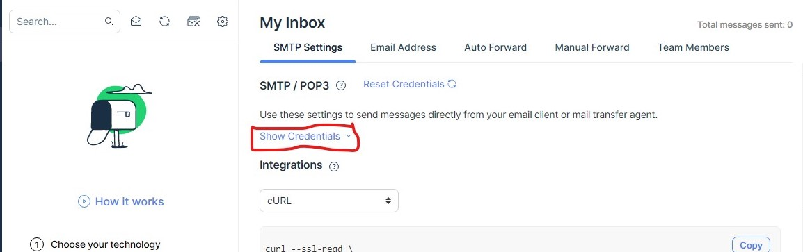

# Serviço que contacta cliente via email

Esta aplicação tem como principal função contactar o cliente via e-mail, informando o status da sua compra.  Ele fica escutando os eventos da fila `contact` e para cada evento recebido tenta realizar o envio de um email, conforme pode ser visto na sua função processMessage:

```JavaScript
async function processMessage(msg) {
    const mailData = JSON.parse(msg.content)
    try {
        const transporter = await nodemailer.createTransport({
            host: "smtp.mailtrap.io",
            port: 2525,
            auth: {
                user: process.env.USER,
                pass: process.env.PASS
            }
        })

        const mailOptions = {
            'from': process.env.MAIL_USER,
            'to': `${mailData.clientFullName} <${mailData.to}>`,
            'cc': mailData.cc || null,
            'bcc': mailData.cco || null,
            'subject': mailData.subject,
            'text': mailData.text,
            'attachments': null
        }

        await transporter.sendMail(mailOptions)

        console.log(`✔ SUCCESS`)
    } catch (error) {
        console.log(`X ERROR TO PROCESS: ${error.response}`)
    }
}
```

Esta aplicação está integrada há uma ferramenta chamada [mailtrap](https://mailtrap.io/). Portanto para sua execução é necessário a [criação de uma conta](https://mailtrap.io/register/signup?ref=header), fornecendo dados básicos email e nome. 



Com uma conta criada na página principal, no campo `Show Credentials` será possivel obter os campos Username e Password, necessarios para o arquivo de configuração localizado no caminho: [./services/contact/.env](https://github.com/franneves/exemplo-de-uma-arquitetura-orientada-a-eventos/blob/master/services/contact/.env)

Com a atualização dos campos, o arquivo .env, ficara parecido com o abaixo:

```js
RABBITMQ_LOGIN                  = guest
RABBITMQ_PASSWORD               = guest
RABBITMQ_HOST                   = q-rabbitmq
RABBITMQ_PORT                   = 5672
RABBITMQ_VHOST                  = 
RABBITMQ_QUEUE_NAME             = contact

USER  = "a361840f92fg31"
PASS  = "a16cb6f3d35b70"
```


Após está configuração todo email que for enviado na aplicação será possivel de ser visualizado na sua conta teste do mailtrap.  P

Para executar a aplicação basta ter um docker em execução e digitar o comando abaixo na raiz do projeto:

```
docker-compose up -d --build contact-service
````
 
Assim que o build finalizar, a aplicação irá se conectar com RabbitMQ e ficara escutando notificação de eventos na fila `contact`
